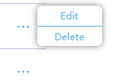
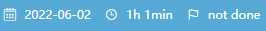
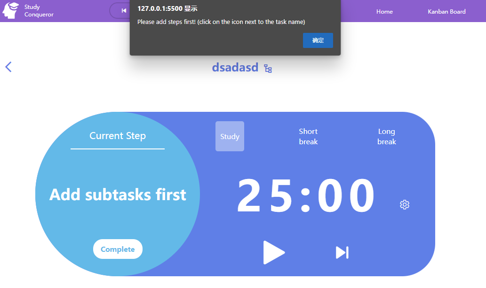
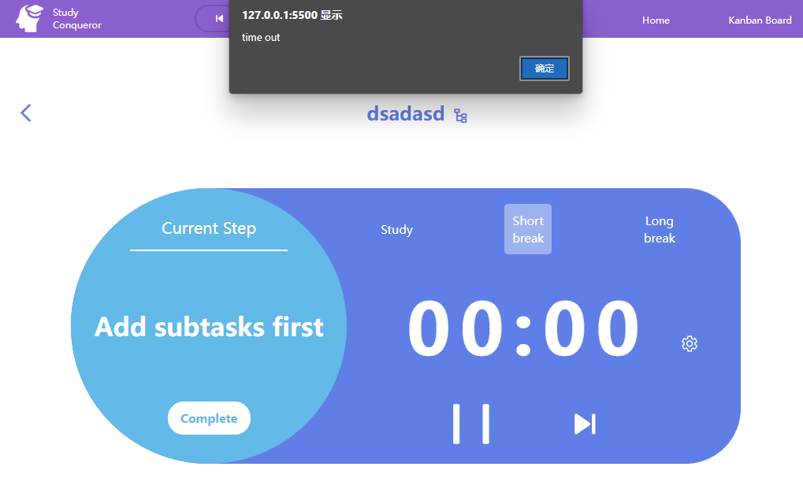

# Iteration based on feedback and further self-reflection

1. ### **The music player:** 

   *Before:*

   

   **Feedback:** When two of my testing participants viewed the old version of the music player, they expressed confusion about how long the current song had been playing and how much time remained. On the other hand, two participants mentioned that it it looks a little bit disharmonious on the bar.

   **Self-reflection:** The first problem I need to overcome is figuring out how to add a progress indicator inside the music player. In terms of layout, I believe the buttons take up too much space, making the song information less apparent to users. Furthermore, the white backdrop creates too much contrast for the eyes. I thought that's why users found it disharmonious.

   *After:*

   

   

2. ### **The Kanban board card**: 

   This is my first attempt at designing a Kanban board card. The user may directly fill in the task information by clicking on the corresponding input.

   *Before:* 

   

   **Feedback:** According to user testing feedback, 3/6 participants thought this interaction mode was strange because the card almost stayed unchanged before and after they finished filling out the information and saved it.

   **Self-reflection:** I resonated with them. What I considered I did wrong was including too many functions on a single card (user input, delete, edit, save, and display), which increased the user's mental mode burden. I believe the process could be divided into two parts: a form that allows the user to submit information first, followed by displaying the information on a "card" and allowing the user to modify and remove the card.

   

   *After:*

   ​                                                                                                      First step: fill in the input form

   

   ​						 Second step: display the information on a card and user can edit or delete the card by clicking the ellipse on the right

   

   ​                                                                    The task information will still be there when the user edits the card.

   

3. ### **Enter the corresponding task page by double clicking on the card**

   *Before:*

   

   **Feedback:** The majority of my participants were unaware that they may access a specific page by simply twice clicking on the card, . Because there are no hints directing them to do so.

   **Self-reflection:** My initial solution was to set the cursor to pointer when the user hovered over the card to signify that it was clickable. However, this raises another issue: when the user hovers over the ellipse, the cursor remains the same. As a result, the user may be unaware that the ellipse is clickable immediately. On the other hand, using the cursor to advise the user to double click is not intuitive. It's more tending to say "click once." Finally, I altered the background color darker when the user hovered over the card, increasing the likelihood of the double clicking event.

   *After:*

   

   

4. ### **The "subtask circle"** 

   *Before:*

**Feedback:** Three respondents claimed the subtask name was less noticeable. Additionally, they didn't want to know how many steps they'd taken when doing the certain task. Because as the number of steps increases, they will perceive the work to be extremely complicated and will want to end it as soon as possible.

**Self-reflection:** The step number will no longer be shown. And I believe the user feels the subtask name is not apparent because of the light font-weight, and the "Complete" button is too large. Except modifying them, a horizontal line has been placed below the "current step" to assist the user in distinguishing the part.

​       *After:*

5. ### **The timer:**

   *Before:*

   

   **Feedback:** Five participants stated that they will not use the restart button while studying.

   **Self-reflection:**  Their words make sense to me. On the other side, there is no means for the user to skip to the next pomodoro session if they want. As a result, I've replaced the restart button with the skip button.

   

   After: 

   

6. ### **Reading list ellipse**

​	*Before:*

​	**Feedback:** The ellipse in the next line will be hindered by the pop-up menu.

​	**Self-reflection:** To address this problem, I relocate the pop-up menu to the right of the ellipse.

​    After:* 

7. ### **Reading list input form**

   *Before:*

   

   

   **feedback:** Three participants agreed that the input form's function is satisfactory. However, each input, together with two buttons, appears to be separated from one another.

   **Self-reflection:** I believe this is due to I did not add a border or backdrop to the input form area to show they are an entity. As a result, there is now a light gray background.

   

   *After:* 

   

   

8. ### **The rest of things are improving the user experience.**

   1. Because these icons on the card are unclickable, the mouse will not change to the pointer when the user hovers over them.

      

   2. Many users clicked the "Complete" button first when they looked at the task page, and got no response. So I created an alert popup to inform users that they should first add steps.

3. Similarly, when a promodoro session ends, another alert box will notify the user.

